
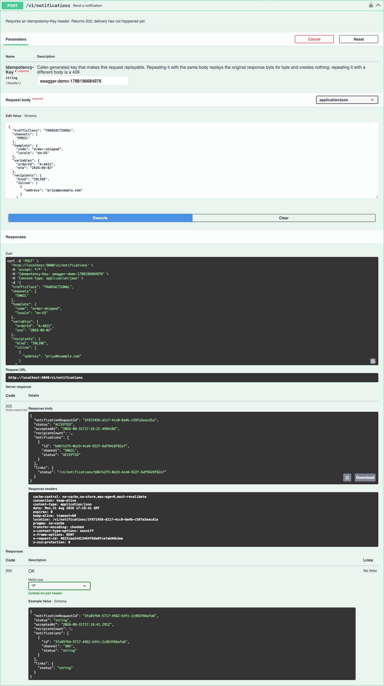
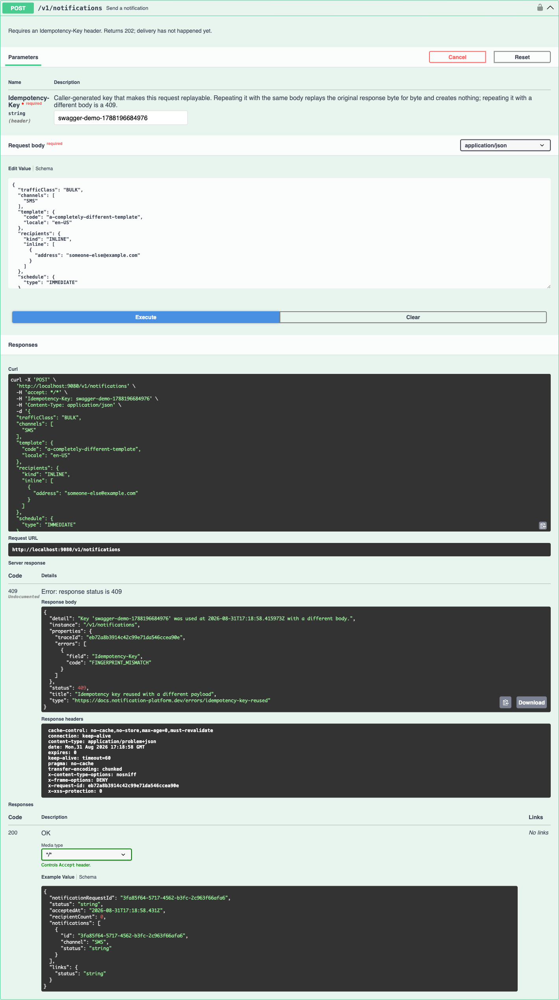
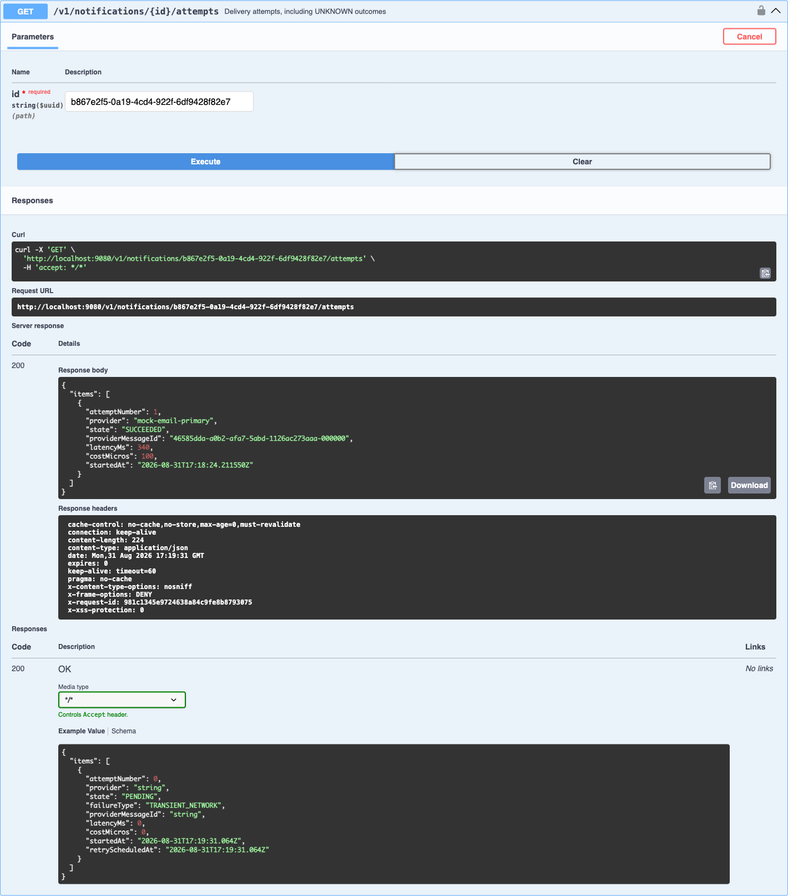
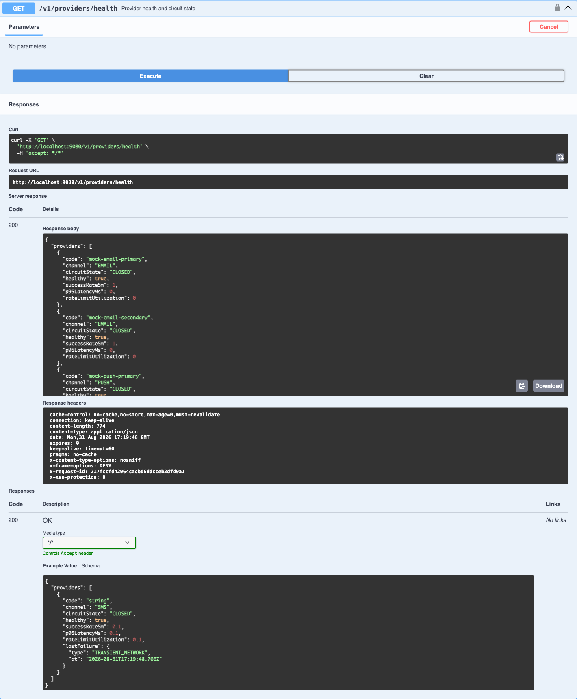
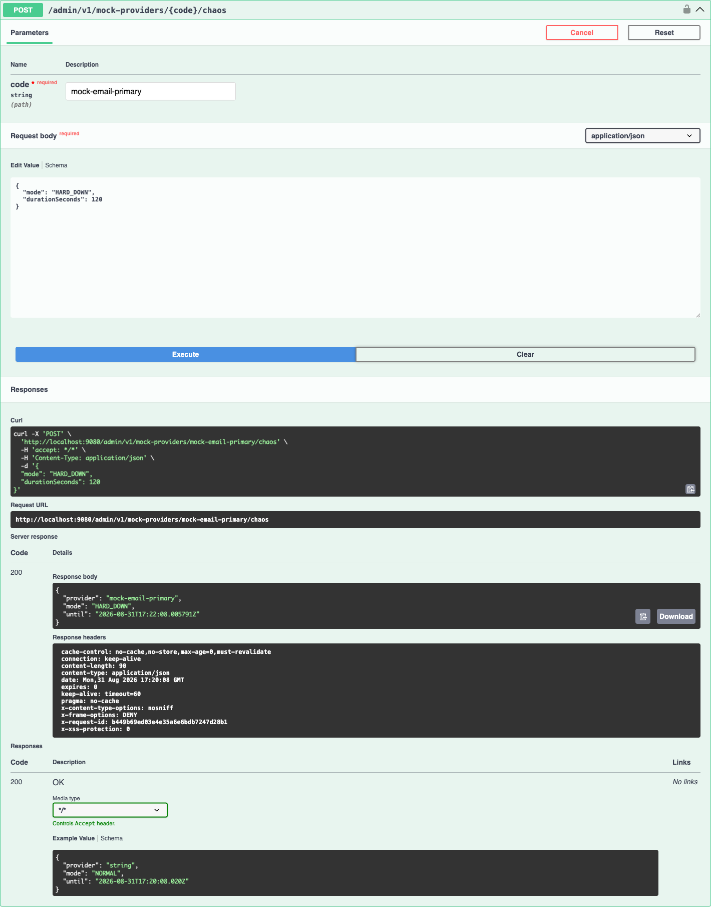
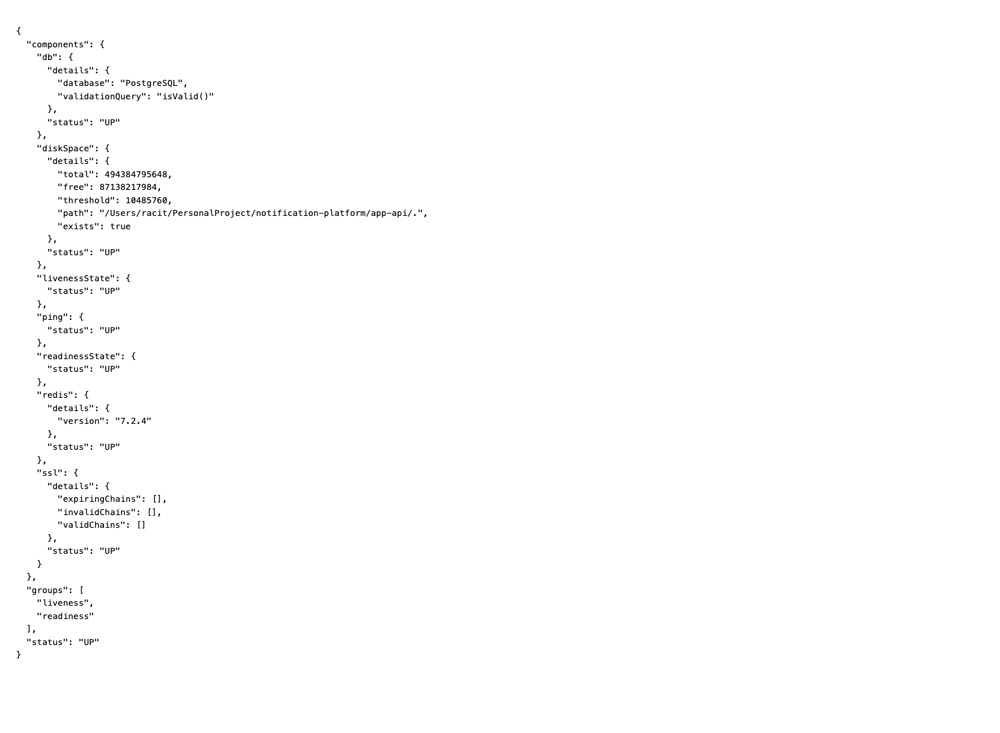
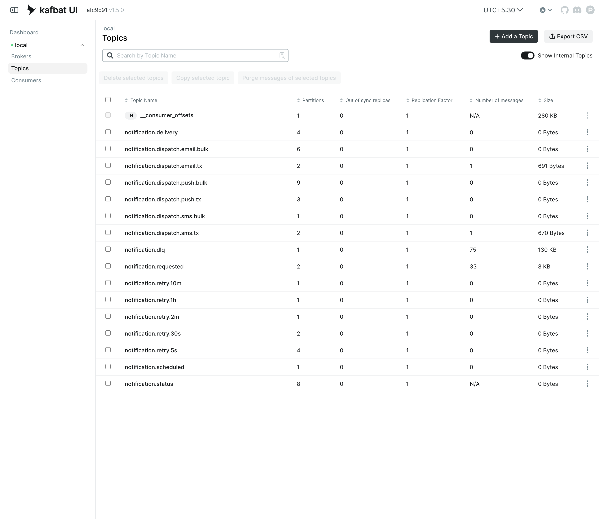
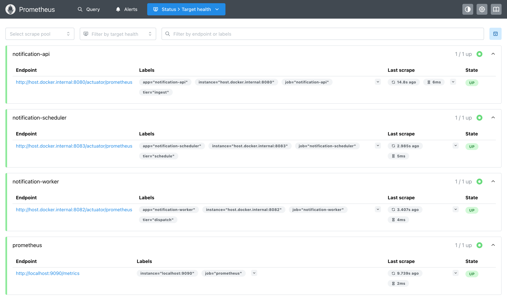
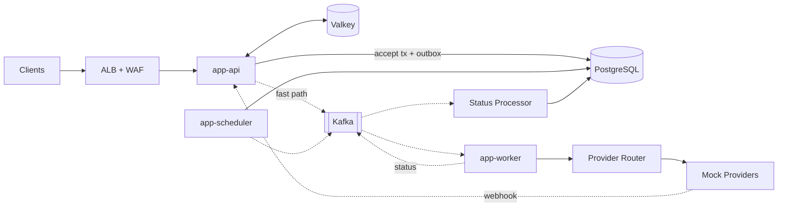

# Notification Platform

[](https://github.com/Gaurav1112/notification-platform/actions/workflows/ci.yml)

A horizontally scalable notification platform for **SMS, email and push** — designed for 50 million
users and hundreds of millions of notifications per day.

Java 17 · Spring Boot 4.1.1 · Kafka 4.3.1 · PostgreSQL 18.6 · Valkey 9.1.1. Eleven Maven modules,
**406 tests green without Docker** (444 with `-Pintegration`), and **zero credentials required**
to build or run the stack.

> This is a systems-design project. The interesting part is not that it sends notifications —
> it is what happens when providers fail, Kafka redelivers, workers crash mid-send, traffic
> spikes 250×, and the same request arrives twice.

> **Honest status.** Run, not asserted.
>
> **Works:** `./mvnw clean verify` is green — 406 tests, 444 under `-Pintegration`. All three
> applications boot (3.8 s / 3.5 s / 8.0 s) and stay up. Flyway builds a 139-table schema from an
> empty database. The accept path works: `202` → replay with an identical body returns the same
> bytes → a reused key with a different body returns `409`.
>
> **Does not work, or has never been seen to work:** a request that sends inline `content` instead
> of a `template` is accepted with a `202` and then dead-lettered, because the Kafka event record
> has no field to carry the body. Nothing has been observed advancing past `QUEUED` — no provider
> send, no `delivery_attempt` row, no `SENT`. The chaos endpoint is disabled under every profile,
> so `make demo` does not run. Two of six provider decorators are still pass-throughs.
> Deduplication is in-memory, so idempotency does not hold across two worker pods. There is no
> load-test harness.
>
> **[STATUS.md](docs/STATUS.md) is the authoritative account** — it is kept accurate deliberately,
> because a portfolio repository that overstates itself fails the moment someone clones it.

**Jump to:** [Try it yourself](#try-it-yourself) · [Architecture](docs/ARCHITECTURE.md) · [Learn it from zero](docs/LEARN-FROM-ZERO.md) · [Code walkthrough](docs/CODE-WALKTHROUGH.md) · [What's built](docs/STATUS.md) · [Security](SECURITY.md) · [ADRs](docs/adr/)

*Sections below are collapsed — click any heading to expand.*

---

<details>
<summary>▶︎ &nbsp;<b>Verified, not claimed</b> — build, boot times, schema counts, idempotency, all regenerated from live commands</summary>

### Verified, not claimed

Every figure below was produced by running a command, not by estimating. The build, schema and
behaviour captures in [docs/verification/](docs/verification/) are regenerated by
`./scripts/capture-verification.sh`; the boot times and the two schema rows come from a
`spring-boot:run` and from applying the migrations to an empty PostgreSQL 18.6 database. If a number
appears elsewhere in this repository and is not in this table or in
[STATUS.md](docs/STATUS.md#measurements), it is modelled rather than measured, and the document that
quotes it says so.

| | |
|---|---|
| `./mvnw -B clean verify` on a fresh clone | **BUILD SUCCESS**, 406 tests, 0 failures, 0 skipped |
| `-Pintegration` (adds the Testcontainers tests) | **444 tests**, 0 failures |
| `app-api` / `app-worker` / `app-scheduler` start | **3.78 s** / **3.46 s** / **8.00 s**, all `/actuator/health` UP |
| Flyway on an empty database | 3 migrations, **0 tables → 140**, `now at version v900` |
| Schema after `V1` | 120 tables · 6 partitioned parents · 107 partitions · 260 indexes · 298 check constraints |
| Schema after `V1` + `V2` | 139 tables · 7 partitioned parents · 125 partitions · 336 indexes · 450 check constraints |
| `POST /v1/notifications` | **202** with a `Location` header; the id in the body is the id in the database, one row per request |
| Same key, same body | **202**, byte-identical response, same ids |
| Same key, different body | **409** `FINGERPRINT_MISMATCH`, RFC 9457 |
| `credentials_ref` CHECK vs a pasted API key | **rejected**; a Secrets Manager ARN is accepted |
| Monotonic guard, five orderings | late `SENT` after `DELIVERED` → 0 rows; duplicate → 0 rows; `BOUNCED` after `DELIVERED` → applied; post-terminal → 0 rows |
| `promtool check rules` | SUCCESS, 52 rules (22 recording, 30 alerting) |


> Figures such as `746 tps` that appear in the design documents came from **design-time prototypes
> on synthetic schemas that are not in this repository**. They explain why the design is shaped
> this way; they are not benchmarks of this code, and each document says so where they appear.

</details>

---

<details>
<summary>▶︎ &nbsp;<b>Screenshots of it running</b> — every claim above, executed in Swagger UI against the live stack</summary>

### Screenshots of it running

The table above is text, and text is cheap. Below is the same set of claims executed through
Swagger UI against a running system — the API on `:9080`, the worker on `:9082`, the scheduler on
`:9081`, PostgreSQL, Kafka and Valkey in Docker. Each image shows the request that was sent, the
`curl` equivalent, the request URL, and the server's actual response including headers.

They are screenshots of the application, not of a document describing the application. Every one
was taken by driving the real UI; nothing here is a mockup.

#### The whole API surface

Eight endpoints, three tags, plus the local-only chaos controller.



#### Accept: `POST /v1/notifications` → 202

The `Idempotency-Key` header, the request body, and the response — `202`, a `Location` header, and
one notification id per channel. Not `200`, which would claim the message was delivered.


#### Idempotent replay: same key, same body → byte-identical 202

Executed a second time with no change. Same `notificationRequestId`, same notification id, and the
**same `acceptedAt`** — `17:18:22.498410Z` in both. That timestamp is the proof: it is the moment
of the *first* accept, replayed. A second accept would have carried a later one.



#### Same key, different body → 409

The body is changed to a different traffic class, channel, template and recipient, and the key is
reused. A system that keyed on the header alone would happily replay the *first* response and
silently discard this request. The SHA-256 body fingerprint catches it:

```
"code": "FINGERPRINT_MISMATCH"
"title": "Idempotency key reused with a different payload"
```

`content-type: application/problem+json` — RFC 9457, with a `traceId` in `properties`.



#### A real delivery attempt

`GET /v1/notifications/{id}/attempts` for the notification accepted above. One attempt, `SUCCEEDED`
through `mock-email-primary`, with the provider's message id, a measured latency and a cost. The
row was written before the provider call and completed after it.



#### Provider health and circuit state

Five providers across three channels, each with its circuit state and success rate, assembled from
the same meters the router scores on rather than from a separate health table.



#### Breaking a provider on purpose

`POST /admin/v1/mock-providers/mock-email-primary/chaos` with `HARD_DOWN`. The response echoes the
resolved deadline rather than the requested duration, because the window is clamped — an operator
who asks for two weeks should be able to see that they did not get it.



#### Failover, with the primary broken

The same request again, with `mock-email-primary` down in the worker. Attempt **number 1** goes to
`mock-email-secondary` and succeeds:

```json
{ "attemptNumber": 1, "provider": "mock-email-secondary", "state": "SUCCEEDED",
  "latencyMs": 55, "costMicros": 400 }
```

Read the attempt number. There is no failed attempt 1 followed by a retry — the router removed the
unhealthy provider from the candidate set *before* selecting, so the caller never paid for a
timeout. Compare `costMicros`: 400 on the secondary against 100 on the primary. Failover is not
free, which is exactly why the primary is preferred while it is healthy.


#### The stack underneath

`/actuator/health` — PostgreSQL and Valkey both UP, with liveness and readiness groups.



Kafka topics as the broker reports them, and Prometheus scraping all three applications:





> **One honest note about chaos and process boundaries.** `ChaosState` is an in-process object, so
> a fault injected through the API's copy of the endpoint affects the API's mocks and nothing else.
> Sending happens in the worker, so the failover capture above was driven against the worker's
> endpoint on `:9082`. That is the truthful model rather than a limitation to hide: a fault in one
> pod's provider adapter is not cluster-wide, and an endpoint that pretended otherwise would be
> lying about the blast radius.

</details>

---

<details>
<summary>▶︎ &nbsp;<b>Try it yourself</b> — clone, run, and exercise the API (9 steps; step 7 is the one that does not run)</summary>

### Try it yourself

The responses below are **real captured output** from a running instance. Requires a JDK 17 and
Docker; no credentials, no accounts, no vendor keys. Steps 1 to 6, 8 and 9 work today. **Step 7 does
not**, and says why.

```bash
git clone https://github.com/Gaurav1112/notification-platform.git
cd notification-platform

make up                                    # postgres, valkey, kafka + 16 topics, prometheus, grafana
./mvnw -q -B -DskipTests install

# three terminals, or append & to each
./mvnw -pl app-api       spring-boot:run   # :8080  — Flyway builds the schema on first start
./mvnw -pl app-worker    spring-boot:run   # :8082  — consumes Kafka, calls providers
./mvnw -pl app-scheduler spring-boot:run   # :8083  — outbox sweeper, due scan
```

> Add `-Dspring-boot.run.arguments=--server.port=9080` to any of them if those ports are taken.
> `app-api` must run for the schema to exist; `app-worker` must run for a notification to progress
> past `ACCEPTED`. On Rancher Desktop or Colima, export `DOCKER_HOST` first — the `Makefile` has a
> guard that tells you the value.

### 1 · Send a notification

```bash
curl -X POST http://localhost:8080/v1/notifications \
  -H 'Content-Type: application/json' \
  -H 'Idempotency-Key: demo-001' \
  -d '{
    "trafficClass": "TRANSACTIONAL",
    "channels": ["EMAIL"],
    "template":   { "code": "order-shipped", "locale": "en-US" },
    "variables":  { "orderId": "A-4821", "eta": "2026-09-02" },
    "recipients": { "kind": "INLINE", "inline": [{ "address": "priya@example.com" }] },
    "schedule":   { "type": "IMMEDIATE" }
  }'
```

**`202 Accepted`**

```json
{
  "notificationRequestId": "e7fefe39-1b51-4bf9-b638-d5a962e01129",
  "status": "ACCEPTED",
  "acceptedAt": "2026-08-31T16:45:21.922524Z",
  "recipientCount": 1,
  "notifications": [
    { "id": "f61af9f5-7dda-4069-8b25-83b105419f2c", "channel": "EMAIL", "status": "ACCEPTED" }
  ],
  "links": { "status": "/v1/notifications/f61af9f5-7dda-4069-8b25-83b105419f2c" }
}
```

`202`, not `200`. A `200` would imply the message was delivered; nothing has been sent yet. `202`
means the request is durably recorded and we have taken responsibility for it.

> **Use `template`, not `content` — this is a real defect, not a caveat.** Inline content
> (`"content": {"subject":…, "body":…}`) passes the request's own
> `@AssertTrue("exactly one of template or content must be supplied")` validation and returns a
> `202`, then fails at fan-out with `TemplateRenderingException: no templateCode on the request`.
> `NotificationRequestedEvent` has no `content`, `body` or `subject` field at all, so the body never
> leaves `app-api`. The message is retried three times and lands in `notification.dlq` — not
> dropped, which is the right destination for a request the platform cannot execute, but the caller
> sees a `202` and an id that never advances. Tracked in
> [STATUS.md](docs/STATUS.md#the-one-defect-that-loses-work-inline-content-is-accepted-and-then-dead-lettered).

### 2 · Idempotency — send the *same* request again

```bash
# identical key, identical body
curl -X POST http://localhost:8080/v1/notifications \
  -H 'Content-Type: application/json' -H 'Idempotency-Key: demo-001' \
  -d '{ ...exactly the same body... }'
```

**`202` — byte-identical response.** Same `notificationRequestId`, same `acceptedAt`, same
notification id. Nothing new is created; check the database and there is one record.

### 3 · Idempotency — same key, *different* body

```bash
curl -X POST http://localhost:8080/v1/notifications \
  -H 'Content-Type: application/json' -H 'Idempotency-Key: demo-001' \
  -d '{ "trafficClass": "BULK", "channels": ["SMS"], ... }'
```

**`409 Conflict`** — RFC 9457 `application/problem+json`:

```json
{
  "type": "https://docs.notification-platform.dev/errors/idempotency-key-reused",
  "title": "Idempotency key reused with a different payload",
  "status": 409,
  "detail": "Key 'demo-001' was used at 2026-08-31T15:18:01.753854Z with a different body.",
  "instance": "/v1/notifications",
  "properties": {
    "traceId": "4ef686322ef84c1bb809fd2d2a9066fe",
    "errors": [{ "field": "Idempotency-Key", "code": "FINGERPRINT_MISMATCH" }]
  }
}
```

This is the part most implementations skip. We store a SHA-256 fingerprint of the body, so the same
key with a *different* payload is an error rather than a silent replay of an unrelated response.

### 4 · Check status

```bash
curl http://localhost:8080/v1/notifications/f61af9f5-7dda-4069-8b25-83b105419f2c
```

```json
{
  "id": "f61af9f5-7dda-4069-8b25-83b105419f2c",
  "channel": "EMAIL",
  "trafficClass": "TRANSACTIONAL",
  "status": "IN_PROGRESS",
  "createdAt": "2026-08-31T16:45:21.922524Z",
  "counts": { "total": 1, "delivered": 0, "failed": 0, "suppressed": 0, "pending": 1 },
  "links": {
    "recipients": "/v1/notifications/f61af9f5-.../recipients",
    "attempts":   "/v1/notifications/f61af9f5-.../attempts"
  }
}
```

That capture was taken with **only `app-api` running**, which is why it reads `IN_PROGRESS` with
`pending: 1`. Start `app-worker` and it advances to `QUEUED`.

> **How far it actually gets.** `QUEUED` is the furthest state that has been observed, and only on
> the template path. No `delivery_attempt` row has been seen written by a running worker, and no
> `SENT` or `DELIVERED`. The dispatch components are built and unit-tested; that they are correctly
> wired to each other at runtime is **unproven**, not proven. [STATUS.md](docs/STATUS.md#partial).

### 5 · Delivery attempts

```bash
curl http://localhost:8080/v1/notifications/{id}/attempts
```

Designed to return one row per provider call, including `state: "UNKNOWN"` when a provider timed out
after possibly delivering — the case most designs collapse into "failed" and then wrongly retry. The
endpoint and the `DeliveryAttemptRecorder` behind it both exist; a non-empty response has not been
observed, because nothing has reached the provider call yet.

### 6 · Provider health

```bash
curl http://localhost:8080/v1/providers/health
```

```json
{
  "providers": [
    { "code": "mock-email-primary",   "channel": "EMAIL", "circuitState": "CLOSED",
      "healthy": true, "successRate5m": 1.0, "p95LatencyMs": 0.0, "rateLimitUtilization": 0.0 },
    { "code": "mock-email-secondary", "channel": "EMAIL", "circuitState": "CLOSED",
      "healthy": true, "successRate5m": 1.0, "p95LatencyMs": 0.0, "rateLimitUtilization": 0.0 },
    { "code": "mock-push-primary",    "channel": "PUSH",  "circuitState": "CLOSED", "...": "..." }
  ]
}
```

Five provider beans across three adapter classes — two each for SMS and email so failover has
somewhere to go, one for push.

### 7 · The chaos endpoint — does not run today

```bash
curl -X POST http://localhost:8080/admin/v1/mock-providers/mock-email-primary/chaos \
  -H 'Content-Type: application/json' \
  -d '{"mode":"HARD_DOWN","durationSeconds":120}'
```

**This returns `404`, under every profile including `local`.** `ChaosController` is
`@ConditionalOnProperty(name = "notification.providers.mock-chaos.enabled", havingValue = "true")`,
`application.yml` sets it to `false` in the base document, and there is no `local` override. `make
demo` therefore does not run either.

Flipping the flag would not be enough. `ChaosState` is an in-JVM `ConcurrentHashMap`,
`ChaosController` ships only in `app-api`, and `app-worker` does not depend on `app-api` — the class
is not in the worker jar. With no shared store, an HTTP call to the API cannot reach the providers
the worker calls. Making this demo real means moving chaos state into Valkey.

What *is* real: `provider_circuit_state` is exported on the **worker's** `/actuator/prometheus`
(`0` CLOSED, `1` HALF_OPEN, `2` OPEN, `3` FORCED_OPEN), one series per `(provider, channel)`;
`CircuitBreakerProvider` records into a real Resilience4j breaker; and `CircuitBreakerProviderTest`
drives traffic until the breaker opens and asserts on its state. The mechanism is tested. The
one-command demo of it is not wired.

```bash
curl -s http://localhost:8082/actuator/prometheus | grep provider_circuit_state
```

### 8 · Look at the plumbing

| | |
|---|---|
| Swagger UI | http://localhost:8080/swagger-ui/index.html |
| Kafka topics + message counts | http://localhost:8081 |
| Prometheus | http://localhost:9090 |
| Grafana | http://localhost:3000 |
| Health | http://localhost:8080/actuator/health |
| Metrics | http://localhost:8080/actuator/prometheus |

```bash
make psql     # psql on the notification database
```

```sql
SELECT id, status, channel, created_at FROM notif.notification ORDER BY created_at DESC LIMIT 5;
SELECT count(*) FROM notif.outbox_message;              -- 0 once the sweeper has drained it
SELECT code, rank, is_terminal FROM notif.delivery_status ORDER BY rank;
```

Captured terminal output from all of the above: [docs/verification/](docs/verification/).

### 9 · Run the tests

```bash
make test      # ./mvnw -B verify                 406 tests, no Docker needed
make test-it   # ./mvnw -B verify -Pintegration   444 tests, needs Docker
```

Integration tests are tagged and excluded by default so a clean clone builds green on any machine.
Only two test classes actually need a container — the PostgreSQL base class in
`platform-persistence` and `ScheduledWorkStoreIntegrationTest`. `KafkaPipelineIntegrationTest` uses
`@EmbeddedKafka` and runs in the Docker-less build.

</details>


---

## The problem

Send SMS, email and push notifications to 50M users. Requests may be immediate or scheduled.
Multiple providers exist per channel. Providers fail. Support retries, delivery tracking and
horizontal scalability at millions of notifications per day.

## What makes this non-trivial

The `Built?` column was re-checked against the code for this revision. "Runs" means it has been
observed working on a live stack; "built" means the code and its tests exist and the runtime
behaviour has not been watched.

| Challenge | How it's solved | Built? |
|---|---|---|
| A 10M-recipient campaign must not delay a login OTP | Traffic classes are **physically separate** Kafka topics with independent consumer groups — not a priority field, which FIFO partitions make meaningless | **built** — 6 dispatch topics of 16 exist on the broker, three channel workers subscribe with separate container factories for tx and bulk; no message has been observed consumed off a dispatch topic |
| "Saved to DB, then published to Kafka" can lose notifications | **Transactional outbox** — the notification and the outbox row commit together, and `OutboxSweeper` publishes on its next 100 ms pass | **runs** — the outbox is what actually delivered the accepted event to the worker. The post-commit **fast path is not built**: `OutboxOwnedEventPublisher.publishRequested` deliberately does not produce, because `RequestedNotice` cannot carry the audience or the accept-time event id, and producing anyway would fan the campaign out twice. `TODO(phase-5)` on that class |
| A provider ACKs *after* our client timeout | A first-class **`Indeterminate`** case in a sealed `SendResult`. Never blind-retry — that is how people get three OTPs | **built** — the case exists, `TimeoutProvider` returns it, `CircuitBreakerProvider` counts it against the provider. The reconciler that resolves it is **not** built |
| 100k messages all retry the instant a provider recovers | **Full jitter** (`random(0, backoff)`), not backoff-plus-noise, across five tiered delay topics — plus a retry **budget**, because jitter fixes *when* and not *how many* | **runs** — `BackoffStrategy.FULL`, `RetryTiers`, `RetryBudget`. A failing message was observed retried three times and then dead-lettered to `notification.dlq` |
| 40 pods each admit 3 half-open probes at the same instant | Per-JVM **jittered** open-state duration. 120 synchronised probes would re-open every breaker together and build a 30-second oscillator | **built** — and it was a pass-through until commit `e8f6ddb`, which is the most instructive bug in this repository. `CircuitBreakerProviderTest` now asserts on breaker *state*; `provider_circuit_state` is exported on the worker |
| Webhooks arrive out of order, twice, or not at all | A **monotonic rank guard** — a single atomic SQL statement where a rejected transition returns zero rows rather than throwing | **runs** — five orderings executed against a live PostgreSQL 18.6 in `MonotonicGuardIntegrationTest` |
| N schedulers stampede the same due rows | **Shard affinity** + `SKIP LOCKED` + leases, with a leader-elected scan. The 746-vs-159 tps figure behind this comes from a design-time prototype, not from this code | **built** — `scheduled_notification` now has its migration (`V2`), and `app-scheduler` runs a full session with zero `relation does not exist` and zero `ERROR` lines while holding leadership with a fencing token. No scheduled send has been observed firing |
| GDPR erasure across 90 partitions of a 1.8B-row table | **Crypto-shredding** — destroy the per-user DEK; every ciphertext in Postgres, S3, Kafka and the archive dies at once, zero rows rewritten | **design only** — the schema carries the sealed-address columns, but there is no key store, no DEK and no shred path |

## Architecture at a glance



Full diagram set: [`docs/ARCHITECTURE.md`](docs/ARCHITECTURE.md).

<details>
<summary>▶︎ &nbsp;<b>Documentation</b> — 17 documents and 18 ADRs, with what each covers</summary>

### Documentation

| Doc | Contents |
|---|---|
| **[STATUS.md](docs/STATUS.md)** | **What is complete, partial and not started.** Read this before believing anything else |
| [ARCHITECTURE-SUMMARY.md](docs/ARCHITECTURE-SUMMARY.md) | The 2-page version |
| [ARCHITECTURE.md](docs/ARCHITECTURE.md) | Components, flows, patterns, all diagrams |
| [CODE-WALKTHROUGH.md](docs/CODE-WALKTHROUGH.md) | **The guided tour of the actual code** — what each piece does, why it is shaped that way, and the failure it prevents |
| [UNDERSTANDING-THE-DESIGN.md](docs/UNDERSTANDING-THE-DESIGN.md) | The *why* behind the design, before the *how* |
| [LEARN-FROM-ZERO.md](docs/LEARN-FROM-ZERO.md) | Kafka, Redis and Postgres partitioning from first principles |
| [DATABASE.md](docs/DATABASE.md) | Schema, indexes, partitioning, migrations, verified query plans |
| [KAFKA.md](docs/KAFKA.md) | Topics, partition derivation, ordering, repartitioning |
| [API.md](docs/API.md) | REST contracts, request/response JSON, error taxonomy |
| [SCALABILITY.md](docs/SCALABILITY.md) | Capacity model, bottleneck ladder, 1M → 50M users |
| [FAILURE-MODES.md](docs/FAILURE-MODES.md) | Every dependency failure and its degraded behaviour |
| [OBSERVABILITY.md](docs/OBSERVABILITY.md) | SLIs, metric catalogue, burn-rate alerts, dashboards |
| [SECURITY.md](docs/SECURITY.md) | AuthN/Z, encryption, secrets, PII, webhook verification, threat model |
| [RUNBOOK.md](docs/RUNBOOK.md) | On-call procedures, DR failover, DLQ replay |
| [LOAD-TEST.md](docs/LOAD-TEST.md) | A **specification** for a harness that is not written, and an empty results table |
| [ADDING-A-PROVIDER.md](docs/ADDING-A-PROVIDER.md) | One class plus two config rows, against the real SPI |
| [adr/](docs/adr/) | 18 architecture decision records, each with the negative consequences |
| [Design spec](docs/design/DESIGN-SPEC.md) | The full source document |

</details>

<details>
<summary>▶︎ &nbsp;<b>Quick start</b> — build, test, and start the stack</summary>

### Quick start

Requires only a **JDK 17** and **Docker**. No Maven install — the wrapper bootstraps itself.

```bash
git clone https://github.com/Gaurav1112/notification-platform.git
cd notification-platform

make help              # every target, with the URLs
```

### Build and test — no Docker needed

```bash
./mvnw -q -B -DskipTests compile    # compile everything
make test                            # ./mvnw -B verify  → 406 tests, no Docker required
make test-it                         # ./mvnw -B verify -Pintegration → 444 tests, needs Docker
```

Integration tests are tagged and excluded by default so a clean clone builds green **without a
Docker daemon**. `-Pintegration` clears the exclusion.

### Start the infrastructure

```bash
make up                # postgres, valkey, kafka + its 16 topics, kafka-ui, prometheus, grafana
make ps                # container status and health
make psql              # a psql shell on the notification database
make down              # stop, keep the volumes
make reset             # DESTRUCTIVE — drop every volume and replay V1
```

```
swagger     http://localhost:8080/swagger-ui.html
kafka-ui    http://localhost:8081
prometheus  http://localhost:9090
grafana     http://localhost:3000        (anonymous admin, local only)
```

On native Linux Docker Engine, `host.docker.internal` does not exist, so Prometheus cannot reach the
host JVMs. Start with:

```bash
HOST_ALIAS='host.docker.internal:host-gateway' make up
```

### Run the applications

The three Spring apps run on the **host**, not in containers, so a debugger attaches and a recompile
is instant. Only infrastructure is dockerised.

```bash
make build                                # ./mvnw -q -B -DskipTests install

./mvnw -pl app-api       spring-boot:run  # :8080 — starts in 3.8 s, runs Flyway
./mvnw -pl app-worker    spring-boot:run  # :8082 — starts in 3.5 s
./mvnw -pl app-scheduler spring-boot:run  # :8083 — starts in 8.0 s
```

All three start and stay up; each was left running for ten minutes with `/actuator/health` returning
UP. `spring-boot-maven-plugin` supplies the `local` profile, so no flags are needed — and a packaged
jar does **not** get that profile, so it starts with authentication on rather than permit-all.

`app-api` must run first: it is the only one of the three with `spring.flyway.enabled: true`, so it
owns the schema. `make wait` and `make status` both work against a running API.

> **`make demo` does not.** The chaos endpoint it drives is disabled under every profile and would
> not reach the worker's providers even if enabled — see step 7 of *Try it yourself*, and
> [STATUS.md](docs/STATUS.md#the-chaos-endpoint-cannot-be-reached-and-could-not-work-if-it-were).

### The accept path

```bash
curl -X POST http://localhost:8080/v1/notifications \
  -H 'Content-Type: application/json' \
  -H 'Idempotency-Key: demo-001' \
  -d '{
    "trafficClass": "TRANSACTIONAL",
    "channels": ["EMAIL"],
    "template": { "code": "welcome", "locale": "en-US" },
    "recipients": { "kind": "INLINE", "inline": [{ "address": "demo@example.com" }] },
    "variables": { "name": "Gaurav" },
    "schedule": { "type": "IMMEDIATE" }
  }'
```

`202`, with a notification id that is really in `notif.notification`. Then:

```bash
curl http://localhost:8080/v1/notifications/{id}
curl http://localhost:8080/v1/notifications/{id}/attempts
```

The designed lifecycle is `PENDING → QUEUED → SENT → DELIVERED`. **`QUEUED` is as far as this has
been observed going**, and only with a `template`; a request using inline `content` is accepted and
then dead-lettered. Do not take the two later states on trust — [STATUS.md](docs/STATUS.md#partial)
says exactly what has and has not been seen.

### The failover behaviour the breaker implements

Not a script you can run — the chaos switch that would drive it is off (step 7). This is what
`ProviderCircuitBreakers`, `CircuitBreakerProvider` and `ChannelProviderRouter` are configured to do,
and what `CircuitBreakerProviderTest` asserts by driving the breaker directly:

```
t+0s    mock-sms-primary starts failing
t+…     circuit breaker OPEN (>50% failure over ≥20 calls in a 60 s window)
t+…     router drops it from the candidate list → mock-sms-secondary
t+30s   automatic transition to HALF_OPEN, jittered per pod into a 30–60 s band
t+…     3 probes succeed → CLOSED → traffic returns to the cheaper provider
```

The point is not that the circuit opens. **It is that the accept path returns `202` throughout**,
because accept and dispatch are decoupled by the outbox and Kafka — and that half is verified.

</details>

<details>
<summary>▶︎ &nbsp;<b>Mock providers</b> — what is mocked, what is not, and why</summary>

### Mock providers

There are no real vendor credentials in this repo — a design decision
([ADR-005](docs/adr/ADR-005-mock-providers.md)), not a shortcut.

The five mocks emulate real vendor **semantics**: Twilio error codes and the fact that Twilio offers
no client idempotency key at all; SES's 50-destination `SendBulkEmail` limit and its bounce and
complaint feedback; FCM's **removal of its `/batch` endpoint in June 2024**, so push is one HTTP/2
request per token; APNs `apns-collapse-id`.

Failures are injected from a **per-message seeded RNG** — a fresh `Random` per draw, keyed on
`(seed, provider, recipient, attempt)` — so the outcome of a send is a pure function of its identity
and CI can assert exactly how many messages reach the DLQ under sixteen threads. Latency is
**log-normal**, because a uniform draw has no tail and a p99 alert you never populate is an alert
you never tested.

Five beans across **three** adapter classes — `MockSmsProvider`, `MockEmailProvider`,
`MockPushProvider`, with two configurations each for SMS and email so failover has somewhere to go.
`ProviderContractTest` is one abstract suite of eight contract tests with one subclass per adapter
class.

Only the leaf adapter is mocked. The SPI, the decorator chain, the registry, the router, the circuit
breaker, the rate limiter, the retry engine and the status pipeline are real code.

> **Two of the six decorators — rate limiter and tracing — are still pass-throughs** with the policy
> written into their Javadoc. The third, `CircuitBreakerProvider`, was one until commit `e8f6ddb`
> and is now real. The rate limiter itself has a production caller today: `RedisQuotaGuard` wraps
> `RedisTokenBucketRateLimiter` and enforces per-tenant quota at accept time; what is missing is the
> per-provider limiter at the send edge. Tracing has no implementation at all. See
> [STATUS.md](docs/STATUS.md#two-decorators-are-still-pass-throughs).

Adding a real provider is one class and two config rows —
see [ADDING-A-PROVIDER.md](docs/ADDING-A-PROVIDER.md).

</details>

<details>
<summary>▶︎ &nbsp;<b>Project layout</b> — 11 modules and what each owns</summary>

### Project layout

```
platform-domain/          entities, value objects, enums, invariants — no Spring imports
platform-application/     4 use cases, 11 ports, all 11 with a production adapter
platform-persistence/     JPA, Flyway, partitioning, the JPA port adapters
platform-messaging/       Kafka producers, consumers, idempotent receiver
platform-provider/        SPI, decorator stack, registry, router, mock adapters
platform-resilience/      retry policies, circuit breakers, rate limiters, the Valkey adapters
platform-observability/   OpenTelemetry, Micrometer                  (empty — package-info only)
platform-security/        authn/z, HMAC, encryption, secrets         (empty — package-info only)
app-api/                  REST, idempotency, webhooks, query, Flyway  :8080
app-worker/               orchestrator, channel workers, retry, status  :8082
app-scheduler/            due scan, claimers, outbox sweeper, retry promoter, partitions  :8083
docker/                   compose, Grafana dashboard, Prometheus rules + SLO alerts
docs/                     the documentation set above, plus 18 ADRs
```

Two of the eleven modules are empty; the other nine carry 301 main Java files.

Module dependencies are one-directional and two properties are **enforced by ArchUnit tests rather
than by review**: the domain module's purity (no Spring, no JPA, no Kafka, no Jackson, no
`java.util.Date`) and tenant scoping (every `@Query` over a tenant-owned table must name
`:tenantId`, with each cross-tenant sweep allowlisted individually and two further tests that fail
when the allowlist rots). Architecture that isn't enforced by a test is a wish.

</details>

<details>
<summary>▶︎ &nbsp;<b>Stack</b> — pinned versions and the ones that must NOT be the newest</summary>

### Stack

Java 17 · Spring Boot 4.1.1 · Kafka 4.3.1 (KRaft) · PostgreSQL 18.6 · Valkey 9.1.1 · Resilience4j ·
Flyway 12 · Testcontainers 2 · JUnit 6 + AssertJ · Micrometer · Prometheus + Grafana

Every version verified live against Maven Central and Docker Hub — see
[§19 of the spec](docs/design/DESIGN-SPEC.md#19-technology-versions)
for the pins that must **not** be the newest available, and why.

Spring Boot 4 traps worth knowing: Jackson's groupId is `tools.jackson`; JUnit is 6; Testcontainers
2.x renamed every artefact; `@EntityScan` moved package; and `resilience4j-spring-boot3` on Boot 4
fails **silently** — no error, no breakers.

</details>

<details>
<summary>▶︎ &nbsp;<b>Design honesty</b> — what this project deliberately does not claim</summary>

### Design honesty

Things this project states rather than hides:

- **Exactly-once delivery is not offered.** Transport is at-least-once, dispatch is idempotent at
  five layers. A provider that ACKs after our timeout can produce a genuine duplicate. Target
  < 0.01%, measured, not eliminated ([ADR-007](docs/adr/ADR-007-at-least-once.md)).
- **No provider we would plausibly integrate offers a usable client idempotency key** — Twilio, SES,
  SendGrid, FCM and APNs all verified. Layer 5 of the idempotency stack is aspirational, and the
  design does not assume it. **SMS is therefore at-most-once on `UNKNOWN`**: a lost OTP is
  recoverable by the user retrying; a duplicate OTP is not.
- **Single region with warm DR**, RTO 30 min / RPO < 5 min. Active/active was considered and
  rejected on cross-region dedup ([ADR-016](docs/adr/ADR-016-single-region.md)).
- **AWS infrastructure is 1.2% of total cost of ownership** at scale — ~$2.46M/month of provider fees
  against ~$30k of AWS. A 20% SMS→push down-route saves 15× the entire AWS bill. The routing engine
  matters more than broker tuning, and the design says so.
- **Load-test numbers are absent, and so is the harness.** [LOAD-TEST.md](docs/LOAD-TEST.md) is a
  specification with an **empty** results table. There is no `load-test/` directory, no k6 script
  and no Gatling simulation; that document opens by saying so.
- **Reproducible numbers are separated from prototype numbers.** Everything in
  [Verified, not claimed](#verified-not-claimed) came from a live command, and
  `./scripts/capture-verification.sh` regenerates the text captures in
  [docs/verification/](docs/verification/). The `746 vs 159 tps` scheduler figure is **not** among
  them: it came from a design-time prototype on a synthetic schema that is not in this repository.
  The code it describes now runs — `scheduled_notification` has its migration and the scheduler
  holds leadership without errors — but it has never been benchmarked here. Every document that
  quotes the figure says so where it appears.
- **A pass-through that survived 371 tests is documented, not buried.**
  `CircuitBreakerProvider` was `return delegate.send(command);` for a release. Nothing failed,
  because a permanently-CLOSED breaker is indistinguishable from "no provider has failed yet". It is
  written up in [CODE-WALKTHROUGH.md](docs/CODE-WALKTHROUGH.md) as a lesson about what a green test
  suite does and does not prove.
- **What is unfinished is listed, not implied.** [STATUS.md](docs/STATUS.md).

</details>

## Licence

MIT
