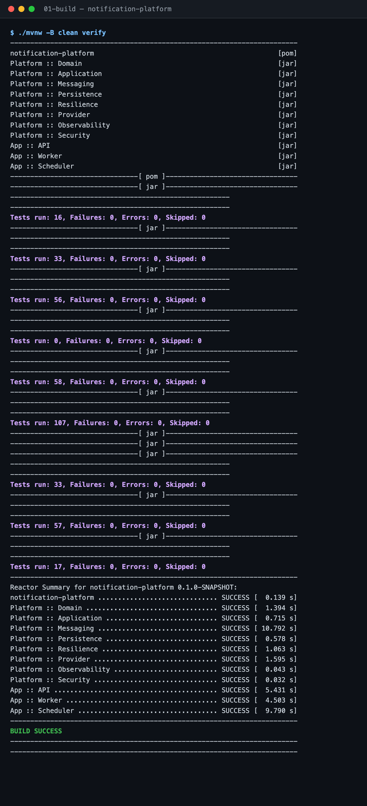
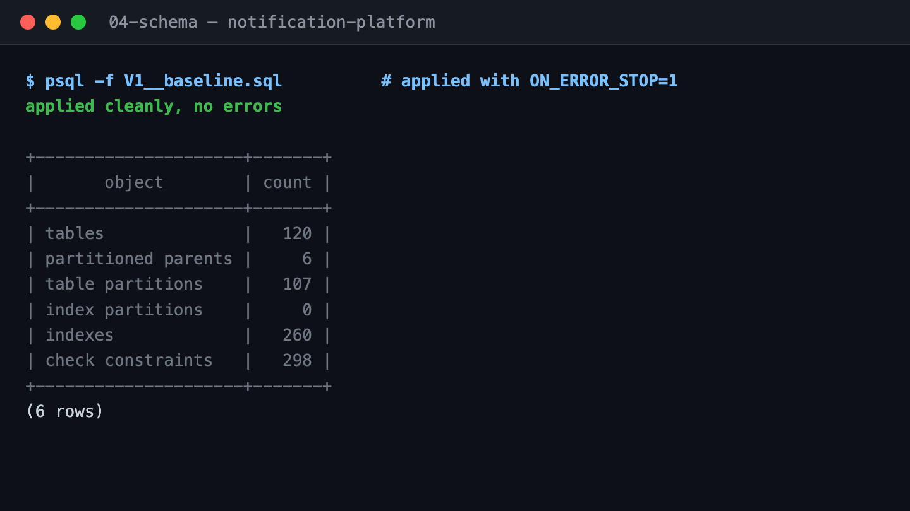
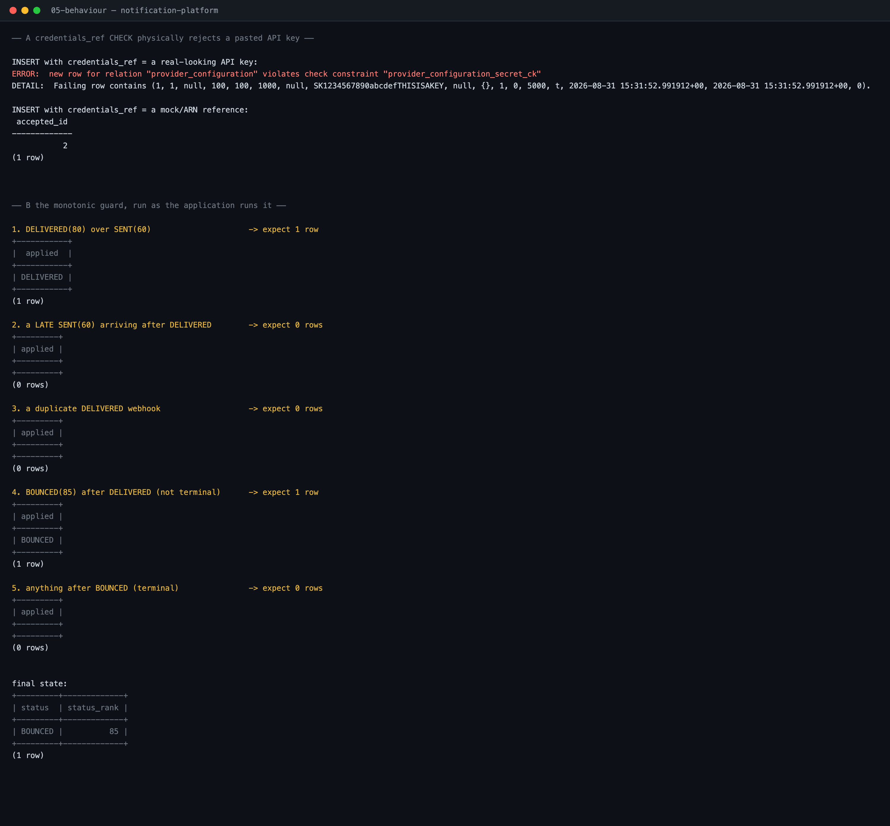
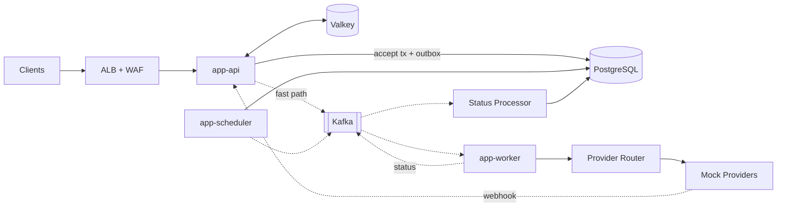

# Notification Platform

A horizontally scalable notification platform for **SMS, email and push** — designed for 50 million
users and hundreds of millions of notifications per day.

Java 17 · Spring Boot 4.1.1 · Kafka 4.3.1 · PostgreSQL 18.6 · Valkey 9.1.1. Eleven Maven modules,
**384 tests green without Docker** (392 with `-Pintegration`), and **zero credentials required**
to build or run the stack.

> This is a systems-design project. The interesting part is not that it sends notifications —
> it is what happens when providers fail, Kafka redelivers, workers crash mid-send, traffic
> spikes 250×, and the same request arrives twice.

> **Honest status.** Verified by cloning this repository fresh and running it, not asserted:
> `./mvnw verify` is green, all three applications start, and the accept path works end to end
> (`202` → replay `202` with an identical body → `409` on a reused key with a different body).
> Evidence, regenerated by `./scripts/capture-verification.sh`, is in
> [docs/verification/](docs/verification/).
>
> Not built: the scheduler's `scheduled_notification` table has no migration, so scheduled sends
> do not run; three of six provider decorators are pass-throughs; deduplication is in-memory, so
> idempotency does not hold across more than one worker pod; there is no load-test harness.
> **[STATUS.md](docs/STATUS.md) is the authoritative account** — it is kept accurate deliberately,
> because a portfolio repository that overstates itself fails the moment someone clones it.

---

## Verified, not claimed

Every figure below comes from `./scripts/capture-verification.sh`, which regenerates
[docs/verification/](docs/verification/) from live commands. Nothing here is hand-written.

| | |
|---|---|
| `./mvnw verify` on a fresh clone | **BUILD SUCCESS**, 384 tests, 0 failures |
| `-Pintegration` (Testcontainers) | 392 tests, 0 failures |
| `app-api` / `app-worker` / `app-scheduler` start | **3.6 s** / **3.4 s** / **8.0 s** |
| Flyway builds the schema on boot | **0 tables → 121** |
| Schema on PostgreSQL 18.6 | 120 tables · 6 partitioned parents · 107 partitions · 260 indexes · 298 check constraints |
| `POST /v1/notifications` | **202** with a notification id |
| Same key, same body | **202**, byte-identical response |
| Same key, different body | **409** `FINGERPRINT_MISMATCH` |
| `credentials_ref` CHECK vs a pasted API key | **rejected**; a Secrets Manager ARN is accepted |
| Monotonic guard, five orderings | late `SENT` after `DELIVERED` → 0 rows; duplicate → 0 rows; `BOUNCED` after `DELIVERED` → applied; post-terminal → 0 rows |
| `promtool check rules` | SUCCESS, 52 rules |







> Figures such as `746 tps` that appear in the design documents came from **design-time prototypes
> on synthetic schemas that are not in this repository**. They explain why the design is shaped
> this way; they are not benchmarks of this code, and each document says so where they appear.

---

## The problem

Send SMS, email and push notifications to 50M users. Requests may be immediate or scheduled.
Multiple providers exist per channel. Providers fail. Support retries, delivery tracking and
horizontal scalability at millions of notifications per day.

## What makes this non-trivial

| Challenge | How it's solved | Built? |
|---|---|---|
| A 10M-recipient campaign must not delay a login OTP | Traffic classes are **physically separate** Kafka topics with independent consumer groups — not a priority field, which FIFO partitions make meaningless | yes |
| "Saved to DB, then published to Kafka" can lose notifications | **Transactional outbox** — the notification and the outbox row commit together; a post-commit fast path keeps the accept path off the critical path of a broker outage | yes |
| A provider ACKs *after* our client timeout | A first-class **`Indeterminate`** case in a sealed `SendResult`. Never blind-retry — that is how people get three OTPs | yes; the reconciler that resolves it is **not** built |
| 100k messages all retry the instant a provider recovers | **Full jitter** (`random(0, backoff)`), not backoff-plus-noise, across five tiered delay topics — plus a retry **budget**, because jitter fixes *when* and not *how many* | yes |
| 40 pods each admit 3 half-open probes at the same instant | Per-JVM **jittered** open-state duration. 120 synchronised probes would re-open every breaker together and build a 30-second oscillator | yes |
| Webhooks arrive out of order, twice, or not at all | A **monotonic rank guard** — a single atomic SQL statement where a rejected transition returns zero rows rather than throwing | yes |
| N schedulers stampede the same due rows | **Shard affinity** + `SKIP LOCKED` + leases, with a leader-elected scan. The 746-vs-159 tps figure behind this comes from a design-time prototype, not from this code | code written, **not running** — `scheduled_notification` has no migration |
| GDPR erasure across 90 partitions of a 1.8B-row table | **Crypto-shredding** — destroy the per-user DEK; every ciphertext in Postgres, S3, Kafka and the archive dies at once, zero rows rewritten | design only |

## Architecture at a glance



Full diagram set: [`docs/ARCHITECTURE.md`](docs/ARCHITECTURE.md).

## Documentation

| Doc | Contents |
|---|---|
| **[STATUS.md](docs/STATUS.md)** | **What is complete, partial and not started.** Read this before believing anything else |
| [ARCHITECTURE-SUMMARY.md](docs/ARCHITECTURE-SUMMARY.md) | The 2-page version |
| [ARCHITECTURE.md](docs/ARCHITECTURE.md) | Components, flows, patterns, all diagrams |
| [CODE-WALKTHROUGH.md](docs/CODE-WALKTHROUGH.md) | **The guided tour of the actual code** — what each piece does, why it is shaped that way, and the failure it prevents |
| [UNDERSTANDING-THE-DESIGN.md](docs/UNDERSTANDING-THE-DESIGN.md) | The *why* behind the design, before the *how* |
| [LEARN-FROM-ZERO.md](docs/LEARN-FROM-ZERO.md) | Kafka, Redis and Postgres partitioning from first principles |
| [DATABASE.md](docs/DATABASE.md) | Schema, indexes, partitioning, migrations, verified query plans |
| [KAFKA.md](docs/KAFKA.md) | Topics, partition derivation, ordering, repartitioning |
| [API.md](docs/API.md) | REST contracts, request/response JSON, error taxonomy |
| [SCALABILITY.md](docs/SCALABILITY.md) | Capacity model, bottleneck ladder, 1M → 50M users |
| [FAILURE-MODES.md](docs/FAILURE-MODES.md) | Every dependency failure and its degraded behaviour |
| [OBSERVABILITY.md](docs/OBSERVABILITY.md) | SLIs, metric catalogue, burn-rate alerts, dashboards |
| [SECURITY.md](docs/SECURITY.md) | AuthN/Z, encryption, secrets, PII, webhook verification, threat model |
| [RUNBOOK.md](docs/RUNBOOK.md) | On-call procedures, DR failover, DLQ replay |
| [LOAD-TEST.md](docs/LOAD-TEST.md) | Harness, scenarios, and an **empty** results table — no invented numbers |
| [ADDING-A-PROVIDER.md](docs/ADDING-A-PROVIDER.md) | One class plus two config rows, against the real SPI |
| [adr/](docs/adr/) | 18 architecture decision records, each with the negative consequences |
| [Design spec](docs/design/DESIGN-SPEC.md) | The full source document |

## Quick start

Requires only a **JDK 17** and **Docker**. No Maven install — the wrapper bootstraps itself.

```bash
git clone https://github.com/Gaurav1112/notification-platform.git
cd notification-platform

make help              # every target, with the URLs
```

### Build and test — no Docker needed

```bash
./mvnw -q -B -DskipTests compile    # compile everything
make test                            # ./mvnw -B verify  → 371 tests, no Docker required
make test-it                         # ./mvnw -B verify -Pintegration → 392 tests, needs Docker
```

Integration tests are tagged and excluded by default so a clean clone builds green **without a
Docker daemon**. `-Pintegration` clears the exclusion.

### Start the infrastructure

```bash
make up                # postgres, valkey, kafka + its 16 topics, kafka-ui, prometheus, grafana
make ps                # container status and health
make psql              # a psql shell on the notification database
make down              # stop, keep the volumes
make reset             # DESTRUCTIVE — drop every volume and replay V1
```

```
swagger     http://localhost:8080/swagger-ui.html
kafka-ui    http://localhost:8081
prometheus  http://localhost:9090
grafana     http://localhost:3000        (anonymous admin, local only)
```

On native Linux Docker Engine, `host.docker.internal` does not exist, so Prometheus cannot reach the
host JVMs. Start with:

```bash
HOST_ALIAS='host.docker.internal:host-gateway' make up
```

### Run the applications

The three Spring apps run on the **host**, not in containers, so a debugger attaches and a recompile
is instant. Only infrastructure is dockerised.

```bash
make build                                # ./mvnw -q -B -DskipTests install

./mvnw -pl app-api       spring-boot:run  # ⚠ see below
./mvnw -pl app-worker    spring-boot:run
./mvnw -pl app-scheduler spring-boot:run
```

> **⚠ None of the three applications starts today.** Verified by running them, not inferred.
>
> `platform-application` declares four `@Service` use cases whose outbound ports —
> `QuotaGuard`, `ResponseSerializer`, `EventPublisher`, `NotificationQuery`,
> `DispatchTombstoneStore` — have **no production beans**; implementations exist only as test
> fakes. All three apps depend on that module and component-scan `dev.gaurav.notification`, so
> all three fail with `UnsatisfiedDependencyException`. `app-api` additionally lacks adapters for
> its own three inbound ports.
>
> Nothing in the test suite catches this: there is **not one `@SpringBootTest` in any app
> module**, so 371 green tests coexist with three applications that cannot boot. A three-line
> `contextLoads()` per app would have caught it, and that is the first fix on the list.
>
> The code beneath is real — controllers, RFC 9457 error handling, interceptors, the webhook
> verifier, the channel workers, the retry chain and the monotonic guard all exist and are
> tested. What is missing is the wiring between the layers.
>
> Consequently the `make demo`, `make status` and `make wait` targets — and the `curl` examples
> below — describe the intended surface rather than something that runs today.
> See [STATUS.md](docs/STATUS.md).

### The intended surface

```bash
curl -X POST http://localhost:8080/v1/notifications \
  -H 'Content-Type: application/json' \
  -H 'Idempotency-Key: demo-001' \
  -d '{
    "trafficClass": "TRANSACTIONAL",
    "channels": ["EMAIL"],
    "template": { "code": "welcome", "locale": "en-US" },
    "recipients": { "kind": "INLINE", "addresses": ["demo@example.com"] },
    "variables": { "name": "Gaurav" },
    "schedule": { "type": "IMMEDIATE" }
  }'
```

Then watch it move through `PENDING → QUEUED → SENT → DELIVERED`:

```bash
curl http://localhost:8080/v1/notifications/{id}
curl http://localhost:8080/v1/notifications/{id}/attempts
```

### The chaos failover demo

`make demo` is the three-minute tour: accept a CRITICAL SMS, replay the same idempotency key, take
the primary provider `HARD_DOWN`, and watch every subsequent send still return `202` while the
breaker opens, traffic fails over, and the circuit half-opens and closes on its own.

```bash
curl -X POST http://localhost:8080/admin/v1/mock-providers/mock-sms-primary/chaos \
     -H 'Content-Type: application/json' \
     -d '{"mode":"HARD_DOWN","durationSeconds":120}'
```

```
t+0s    mock-sms-primary → HARD_DOWN
t+2s    circuit breaker OPEN (>50% failure over ≥20 calls in a 60 s window)
t+2s    router drops it from the candidate list → mock-sms-secondary
t+30s   automatic transition to HALF_OPEN, jittered per pod into a 30–60 s band
t+…     3 probes succeed → CLOSED → traffic returns to the cheaper provider
```

The point is not that the circuit opened. **It is that the accept path never returned a single error
while it happened**, because accept and dispatch are decoupled by the outbox and Kafka.

## Mock providers

There are no real vendor credentials in this repo — a design decision
([ADR-005](docs/adr/ADR-005-mock-providers.md)), not a shortcut.

The five mocks emulate real vendor **semantics**: Twilio error codes and the fact that Twilio offers
no client idempotency key at all; SES's 50-destination `SendBulkEmail` limit and its bounce and
complaint feedback; FCM's **removal of its `/batch` endpoint in June 2024**, so push is one HTTP/2
request per token; APNs `apns-collapse-id`.

Failures are injected from a **per-message seeded RNG** — a fresh `Random` per draw, keyed on
`(seed, provider, recipient, attempt)` — so the outcome of a send is a pure function of its identity
and CI can assert exactly how many messages reach the DLQ under sixteen threads. Latency is
**log-normal**, because a uniform draw has no tail and a p99 alert you never populate is an alert
you never tested.

Only the leaf adapter is mocked. The SPI, the decorator chain, the registry, the router, the circuit
breaker, the rate limiter, the retry engine and the status pipeline are real code.

> Three of the six decorators — circuit breaker, rate limiter, tracing — are currently
> **pass-throughs** with the policy written into their Javadoc. The breaker and the limiter
> themselves are built and tested in `platform-resilience`, and failover works today because the
> worker's router filters open circuits out of the candidate list. See
> [STATUS.md](docs/STATUS.md#three-decorators-are-pass-throughs).

Adding a real provider is one class and two config rows —
see [ADDING-A-PROVIDER.md](docs/ADDING-A-PROVIDER.md).

## Project layout

```
platform-domain/          entities, value objects, enums, invariants — no Spring imports
platform-application/     use cases and ports                        (no production caller yet)
platform-persistence/     JPA, Flyway, partitioning
platform-messaging/       Kafka producers, consumers, idempotent receiver
platform-provider/        SPI, decorator stack, registry, router, mock adapters
platform-resilience/      retry policies, circuit breakers, rate limiters
platform-observability/   OpenTelemetry, Micrometer                  (empty — package only)
platform-security/        authn/z, HMAC, encryption, secrets         (empty — package only)
app-api/                  REST, idempotency, webhooks, query         (does not boot — see STATUS)
app-worker/               orchestrator, channel workers, retry, status
app-scheduler/            due scan, claimers, outbox sweeper, retry promoter, partitions
docker/                   compose, Grafana dashboard, Prometheus rules + SLO alerts
docs/                     the documentation set above, plus 18 ADRs
```

Module dependencies are one-directional and the domain module's purity is **enforced by ArchUnit** —
no Spring, no JPA, no Kafka, no Jackson, no `java.util.Date`. Architecture that isn't enforced by a
test is a wish.

## Stack

Java 17 · Spring Boot 4.1.1 · Kafka 4.3.1 (KRaft) · PostgreSQL 18.6 · Valkey 9.1.1 · Resilience4j ·
Flyway 12 · Testcontainers 2 · JUnit 6 + AssertJ · Micrometer · Prometheus + Grafana

Every version verified live against Maven Central and Docker Hub — see
[§19 of the spec](docs/design/DESIGN-SPEC.md#19-technology-versions)
for the pins that must **not** be the newest available, and why.

Spring Boot 4 traps worth knowing: Jackson's groupId is `tools.jackson`; JUnit is 6; Testcontainers
2.x renamed every artefact; `@EntityScan` moved package; and `resilience4j-spring-boot3` on Boot 4
fails **silently** — no error, no breakers.

## Design honesty

Things this project states rather than hides:

- **Exactly-once delivery is not offered.** Transport is at-least-once, dispatch is idempotent at
  five layers. A provider that ACKs after our timeout can produce a genuine duplicate. Target
  < 0.01%, measured, not eliminated ([ADR-007](docs/adr/ADR-007-at-least-once.md)).
- **No provider we would plausibly integrate offers a usable client idempotency key** — Twilio, SES,
  SendGrid, FCM and APNs all verified. Layer 5 of the idempotency stack is aspirational, and the
  design does not assume it. **SMS is therefore at-most-once on `UNKNOWN`**: a lost OTP is
  recoverable by the user retrying; a duplicate OTP is not.
- **Single region with warm DR**, RTO 30 min / RPO < 5 min. Active/active was considered and
  rejected on cross-region dedup ([ADR-016](docs/adr/ADR-016-single-region.md)).
- **AWS infrastructure is 1.2% of total cost of ownership** at scale — ~$2.46M/month of provider fees
  against ~$30k of AWS. A 20% SMS→push down-route saves 15× the entire AWS bill. The routing engine
  matters more than broker tuning, and the design says so.
- **Load-test numbers are measured or absent.** [LOAD-TEST.md](docs/LOAD-TEST.md) ships a harness
  spec and an **empty** results table. There is no load-test harness in this repository yet, and
  that document says so rather than implying otherwise.
- **Reproducible numbers are separated from prototype numbers.** Everything in
  [Verified, not claimed](#verified-not-claimed) is regenerated from live commands by
  `./scripts/capture-verification.sh`. The `746 vs 159 tps` scheduler figure is **not** among them:
  it came from a design-time prototype on a synthetic schema that is not in this repository, and
  the code it describes cannot currently run because `scheduled_notification` has no migration.
  Every document that quotes it says so where it appears.
- **What is unfinished is listed, not implied.** [STATUS.md](docs/STATUS.md).

## Licence

MIT
