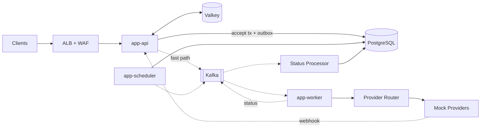

# Notification Platform

A production-grade, horizontally scalable notification platform for **SMS, email and push** —
designed for 50 million users and hundreds of millions of notifications per day.

Built with Java 17, Spring Boot 4, Kafka, PostgreSQL and Valkey. Runs locally with
`docker compose up` and **zero credentials**.

> This is a systems-design project. The interesting part is not that it sends notifications —
> it is what happens when providers fail, Kafka redelivers, workers crash mid-send, traffic
> spikes 250×, and the same request arrives twice.

---

## The problem

Send SMS, email and push notifications to 50M users. Requests may be immediate or scheduled.
Multiple providers exist per channel. Providers fail. Support retries, delivery tracking and
horizontal scalability at millions of notifications per day.

## What makes this non-trivial

| Challenge | How it's solved |
|---|---|
| A 10M-recipient campaign must not delay a login OTP | Traffic classes are **physically separate** Kafka topics with independent consumer groups — not a priority field, which FIFO partitions make meaningless |
| "Saved to DB, then published to Kafka" can lose notifications | **Transactional outbox** — the notification and the outbox row commit together; a post-commit fast path keeps p99 accept latency under 250 ms |
| A provider ACKs *after* our client timeout | A first-class **`UNKNOWN`** state plus reconciliation. Never blind-retry — that is how people get three OTPs |
| 100k messages all retry the instant a provider recovers | **Full jitter** (`random(0, backoff)`), not backoff-plus-noise, across five tiered delay topics |
| Webhooks arrive out of order, twice, or not at all | A **monotonic rank guard** — a single atomic SQL statement where a rejected transition returns zero rows rather than throwing |
| N schedulers stampede the same due rows | **Shard affinity** + `SKIP LOCKED` + leases. Measured **746 tps vs 159** for the naive form |
| GDPR erasure across 90 partitions of a 1.8B-row table | **Crypto-shredding** — destroy the per-user DEK; every ciphertext in Postgres, S3, Kafka and the archive dies at once, zero rows rewritten |

## Architecture at a glance



Full diagram set: [`docs/ARCHITECTURE.md`](docs/ARCHITECTURE.md).

## Documentation

| Doc | Contents |
|---|---|
| [ARCHITECTURE-SUMMARY.md](docs/ARCHITECTURE-SUMMARY.md) | **Start here** — the 2-page version |
| [ARCHITECTURE.md](docs/ARCHITECTURE.md) | Components, flows, patterns, all diagrams |
| [DATABASE.md](docs/DATABASE.md) | Schema, indexes, partitioning, migrations, measured query plans |
| [KAFKA.md](docs/KAFKA.md) | Topics, partition derivation, ordering, repartitioning |
| [API.md](docs/API.md) | REST contracts, request/response JSON, error taxonomy |
| [SCALABILITY.md](docs/SCALABILITY.md) | Capacity model, bottleneck ladder, 1M → 50M users |
| [FAILURE-MODES.md](docs/FAILURE-MODES.md) | Every dependency failure and its degraded behaviour |
| [OBSERVABILITY.md](docs/OBSERVABILITY.md) | SLIs, metrics, burn-rate alerts, dashboards |
| [SECURITY.md](docs/SECURITY.md) | AuthN/Z, encryption, secrets, PII, threat model |
| [RUNBOOK.md](docs/RUNBOOK.md) | On-call procedures, DR failover, DLQ replay |
| [LOAD-TEST.md](docs/LOAD-TEST.md) | Harness, scenarios, measured results |
| [ADDING-A-PROVIDER.md](docs/ADDING-A-PROVIDER.md) | How to plug in a real vendor |
| [adr/](docs/adr/) | 18 architecture decision records |
| [Design spec](docs/superpowers/specs/2026-08-31-notification-platform-design.md) | The full source document |

## Quick start

Requires only a **JDK 17** and **Docker**. No Maven install — the wrapper bootstraps itself.

```bash
git clone https://github.com/Gaurav1112/notification-platform.git
cd notification-platform

docker compose -f docker/compose.yml up -d     # Kafka, PostgreSQL, Valkey, Prometheus, Grafana
./mvnw verify                                   # build + all tests
./mvnw -pl app-api spring-boot:run              # http://localhost:8080
```

Send one:

```bash
curl -X POST http://localhost:8080/v1/notifications \
  -H 'Content-Type: application/json' \
  -H 'Idempotency-Key: demo-001' \
  -d '{
    "trafficClass": "TRANSACTIONAL",
    "channels": ["EMAIL"],
    "template": { "code": "welcome", "locale": "en-US" },
    "recipients": { "kind": "INLINE", "addresses": ["demo@example.com"] },
    "variables": { "name": "Gaurav" },
    "schedule": { "type": "IMMEDIATE" }
  }'
```

Then watch it move through `ACCEPTED → QUEUED → SENT → DELIVERED`:

```bash
curl http://localhost:8080/v1/notifications/{id}
curl http://localhost:8080/v1/notifications/{id}/attempts
```

### See the resilience actually work

Kill the primary SMS provider and watch failover happen:

```bash
curl -X POST http://localhost:8080/admin/v1/mock-providers/mock-sms-primary/chaos \
     -d '{"mode":"HARD_DOWN","durationSeconds":120}'
```

```
t+0s    mock-sms-primary → HARD_DOWN
t+2s    circuit breaker OPEN (>50% failure over 20 calls), state published to Valkey
t+2s    router fails over to mock-sms-secondary
t+120s  outage lifts
t+150s  half-open probe succeeds → CLOSED → traffic returns to the cheaper provider
```

Grafana at `http://localhost:3000` shows the whole sequence. Zero notifications lost.

## Mock providers

There are no real vendor credentials in this repo — and that is a design decision
([ADR-005](docs/adr/ADR-005-mock-providers.md)), not a shortcut.

The mocks emulate real vendor **semantics**: Twilio error codes, SES 50-destination bulk limits
and bounce/complaint feedback, FCM's 500-token multicast cap and `UNREGISTERED` responses,
APNs `apns-collapse-id`. They inject failures from a **seeded RNG** so CI can assert exactly how
many messages reach the DLQ, use **log-normal latency** because real latency is long-tailed, and
call our own webhook endpoint back — late, out of order, duplicated and occasionally not at all.

Only the leaf adapter is mocked. The SPI, all six decorators, the router, circuit breaker, rate
limiter, retry engine, DLQ, webhook verification and status pipeline are real and fully
exercised. Adding a real provider is one class and two config rows —
see [ADDING-A-PROVIDER.md](docs/ADDING-A-PROVIDER.md).

## Project layout

```
platform-domain/          entities, value objects, enums, invariants — no Spring imports
platform-application/     use cases and ports
platform-persistence/     JPA, Flyway, partitioning
platform-messaging/       Kafka producers, consumers, idempotent receiver
platform-provider/        SPI, decorator stack, registry, router, mock adapters
platform-resilience/      retry policies, circuit breakers, rate limiters, bulkheads
platform-observability/   OpenTelemetry, Micrometer
platform-security/        authn/z, HMAC, encryption, secrets
app-api/                  REST, idempotency, webhooks, query          (scales 3 → 60)
app-worker/               orchestrator, channel workers, status       (KEDA on consumer lag)
app-scheduler/            due scan, fan-out, outbox sweeper           (fixed 3, on-demand)
load-test/                k6 scenarios and Gatling simulations
docker/                   compose, Grafana dashboards, Prometheus rules
```

Module dependencies are one-directional and **enforced by ArchUnit** — architecture that isn't
enforced by a test is a wish.

## Stack

Java 17 · Spring Boot 4.1.1 · Kafka 4.3.1 (KRaft) · PostgreSQL 18.6 + pg_partman · Valkey 9.1.1 ·
Resilience4j · Flyway · Testcontainers 2 · OpenTelemetry · Prometheus + Grafana · k6

Every version verified live against Maven Central and Docker Hub — see
[§19 of the spec](docs/superpowers/specs/2026-08-31-notification-platform-design.md#19-technology-versions)
for the pins that must **not** be the newest available, and why.

## Design honesty

Things this project states rather than hides:

- **Exactly-once delivery is not offered.** Transport is at-least-once, dispatch is idempotent.
  A provider that ACKs after our timeout can produce a genuine duplicate. Target < 0.01%,
  measured and published.
- **Single region with warm DR**, RTO 30 min / RPO < 5 min. Active/active was considered and
  rejected ([ADR-016](docs/adr/ADR-016-single-region.md)).
- **AWS infrastructure is 1.2% of total cost of ownership** at scale — provider fees are
  ~$2.46M/month against ~$30k of AWS. A 20% SMS→push down-route saves 15× the entire AWS bill.
  The routing engine matters more than broker tuning, and the design says so.
- **Load-test numbers are measured or absent.** No invented benchmarks.

## Licence

MIT
