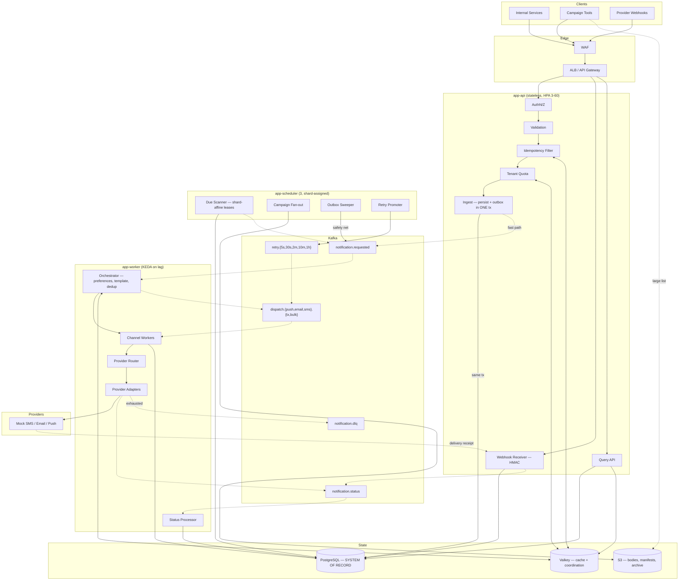
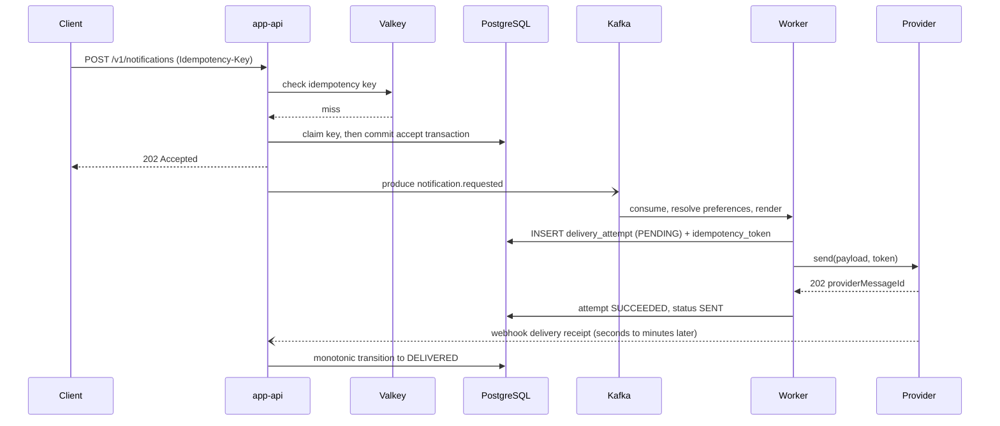
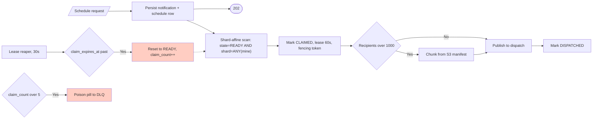
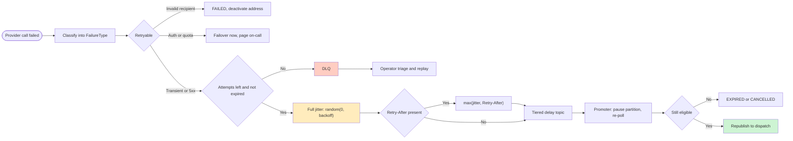
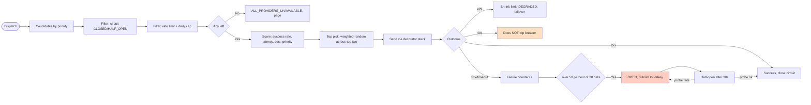
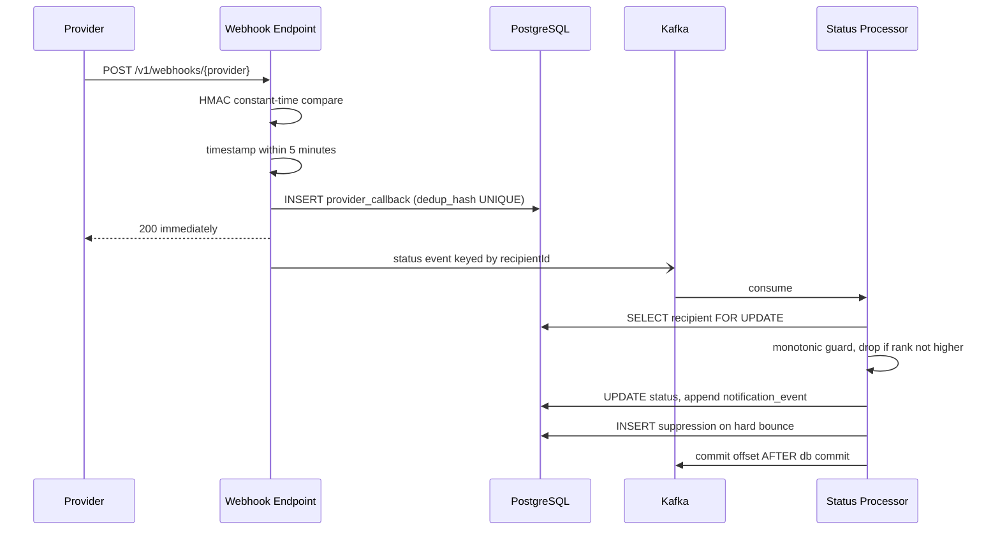
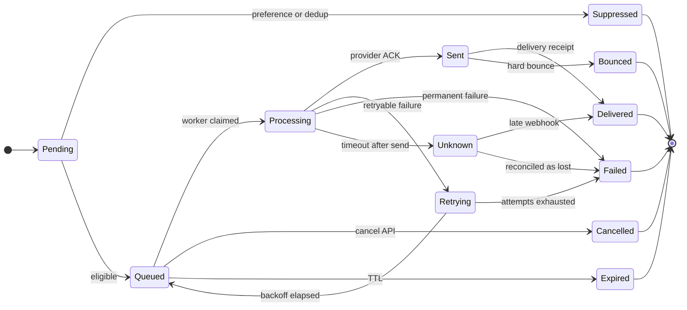
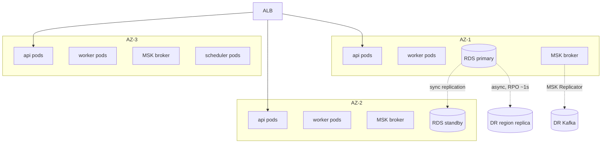

# Architecture

Components, flows, patterns and the full diagram set.
Numbers are derived in [SCALABILITY.md](SCALABILITY.md); schema in [DATABASE.md](DATABASE.md).

---

## 1. System diagram



## 2. Synchronous vs asynchronous

### The sync path — everything that must be correct before we say yes

Budget: **p99 < 250 ms**.

```
1. authenticate + authorise (JWT, tenant scope)
2. validate payload
3. idempotency  → Valkey GET (hit: return stored response, ~2 ms)
                → miss: INSERT idempotency_record ON CONFLICT (durable claim)
4. tenant quota → Valkey token bucket (fail-open if Valkey is down)
5. BEGIN TX
     INSERT notification_request
     INSERT notification (+ recipients, or S3 pointer if large)
     INSERT outbox_message
   COMMIT                        <-- the single atomic accept decision
6. store response in idempotency_record, warm the cache
7. return 202
8. [after commit, best-effort] publish to Kafka
```

Deliberately **absent**: preference lookup, template rendering, dedup, provider selection. Each
is a dependency that could be slow or down, and none should be able to make
`POST /notifications` fail.

### The async path

Orchestrator → preferences (may `SUPPRESS`) → template render → dedup → per-recipient dispatch →
channel worker → provider router → adapter → status event → monotonic state machine → Postgres.
Retries and webhooks re-enter the same spine.

## 3. Components

| Component | Owns | If it dies |
|---|---|---|
| **app-api** | Accept, validate, idempotency, quota, webhooks, query | Stateless. Zero in-flight loss: accept is a committed tx or it never happened |
| **Ingest** | The atomic accept transaction | Crash before commit → client sees 5xx, retries with the same key → no duplicate. Crash after commit before publish → sweeper recovers in ~2 s |
| **app-scheduler** | Due scan, fan-out, outbox sweep, retry promotion | Shard-assigned; leases expire in 60 s so claimed rows are reclaimed. Idempotent by design |
| **Orchestrator** | Preferences, templating, dedup, per-recipient explode | Rebalance; uncommitted offsets redeliver; dedup absorbs it |
| **Channel Worker** | Provider selection, call, attempt recording | The dangerous one — crash *after* the call, *before* the write. Mitigated by pre-registering the attempt + provider-side idempotency token |
| **Status Processor** | Monotonic lifecycle transitions | Must tolerate out-of-order and replayed events; only advances, never regresses |

## 4. Request flow (immediate send)



The `PENDING` attempt row is committed **before** the network call. That converts an invisible
failure into a visible, reconcilable one — see [FAILURE-MODES.md](FAILURE-MODES.md).

## 5. Scheduled flow



Scheduler pods own disjoint shards, so they never contend. `SKIP LOCKED` remains only as a
rebalance-window safety net. Measured 746 tps vs 159 for the naive `FOR UPDATE` form — the naive
version throws no errors, it just serialises, which is why it reads as "the database is slow"
rather than a design bug.

`claim_count > 5` is a poison-pill detector: without it one malformed row crash-loops a pod
forever and never appears in metrics.

## 6. Retry flow



**Full jitter, not backoff-plus-noise.** With 100k messages failing simultaneously, deterministic
backoff means all 100k retry at exactly `t+2s`, re-killing the provider the moment it recovers.

## 7. Provider failover



Circuit state is **shared through Valkey** so 40 worker pods don't each independently discover a
dead provider. A **4xx never trips the breaker** — a malformed payload is our bug, and opening
the circuit on it would take a healthy provider offline.

## 8. Delivery status ingestion



The raw payload is persisted **before** interpretation, so a verification bug is replayable
rather than lost. Committing the Kafka offset after the DB commit means the worst case is
redelivery — absorbed by the monotonic guard.

## 9. Delivery lifecycle



`UNKNOWN` is the state most designs omit — the provider timed out *after* possibly delivering.
Never blind-retry from here.

## 10. Deployment



RTO 30 min, RPO < 5 min. Workers run 70% spot — safe precisely *because* the design is
crash-tolerant; spot eviction is just another instance of the failure model already handled.

## 11. Design patterns

### Architectural
Hexagonal / Ports & Adapters (ArchUnit-enforced) · DDD tactical (aggregate owns invariants) ·
CQRS-light (separate read projections) · modular monolith with three deployables.

### Enterprise integration
Transactional Outbox · Idempotent Receiver · Competing Consumers · Content-Based Router ·
Splitter (fan-out) · Aggregator (campaign rollup) · **Claim Check** (S3 for large recipient
lists) · Dead Letter Channel · Invalid Message Channel (separate from DLQ) · Message Translator ·
Correlation Identifier · Wire Tap (audit) · **Delayed Message** (tiered retry topics) ·
Guaranteed Delivery.

### Resilience
Circuit Breaker (Valkey-shared) · Bulkhead (per channel *and* class) · Retry with full jitter ·
Timeout (always < `max.poll.interval.ms`) · Rate Limiter · Fallback/Failover · Leader Election
with fencing tokens · Cache-Aside · Health Endpoint Monitoring · Backpressure · Graceful
Degradation.

### GoF
Strategy (selection, retry policy) · Adapter (providers) · **Decorator** (the call stack) ·
Template Method (`AbstractChannelWorker`) · Chain of Responsibility (`PreferenceFilterChain`) ·
State (`DeliveryStateMachine`) · Registry · Builder · Observer · Specification · Null Object.

**The decorator stack** — each layer independently testable, and the mock adapter gets identical
resilience behaviour to a real one, which is what makes the failure tests meaningful:

```
ChannelWorker → Traced → Metered → CircuitBreaker → RateLimited → Timeout → Idempotent → Adapter
```

### Deliberately rejected

| Rejected | Why |
|---|---|
| Dual write (DB then Kafka) | No atomicity |
| Full Event Sourcing | Replaying 500M notifications for a status lookup |
| Saga / 2PC | One aggregate, one DB — ceremony |
| Exactly-once on the dispatch path | The provider call cannot enlist in a transaction |
| `Thread.sleep()` retry in-consumer | Holds the partition |
| Naive `WHERE due_at < now()` polling | Measured 159 tps vs 746 |
| Anemic domain model | Invariants belong in the aggregate |
